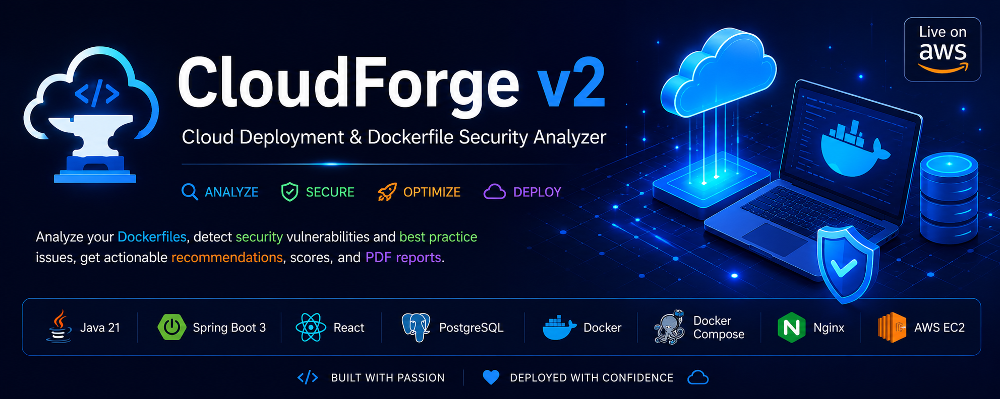
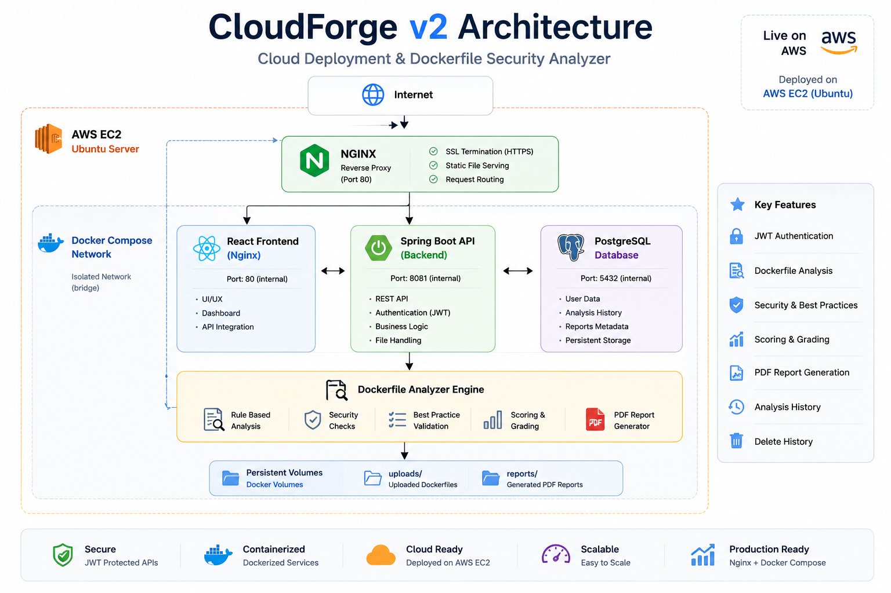
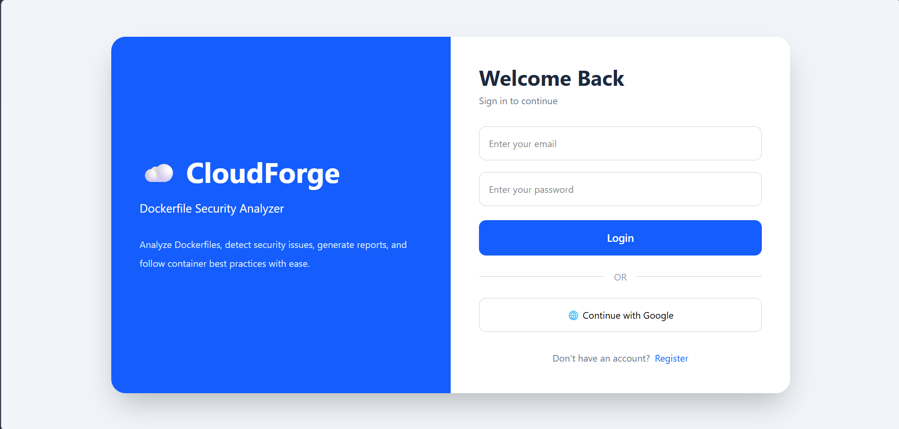
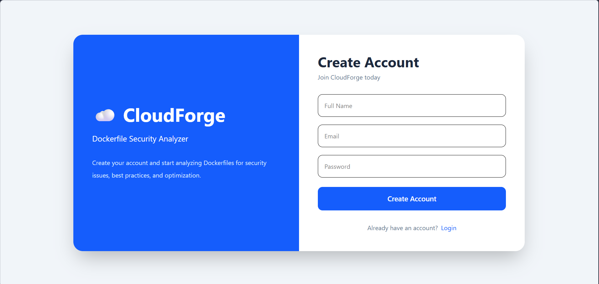
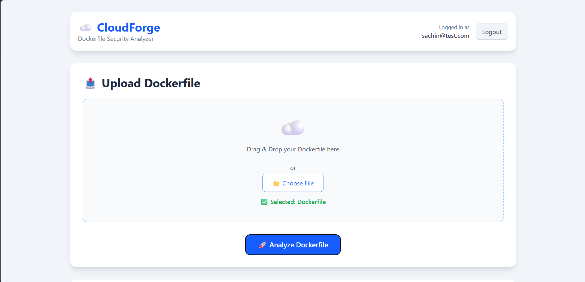
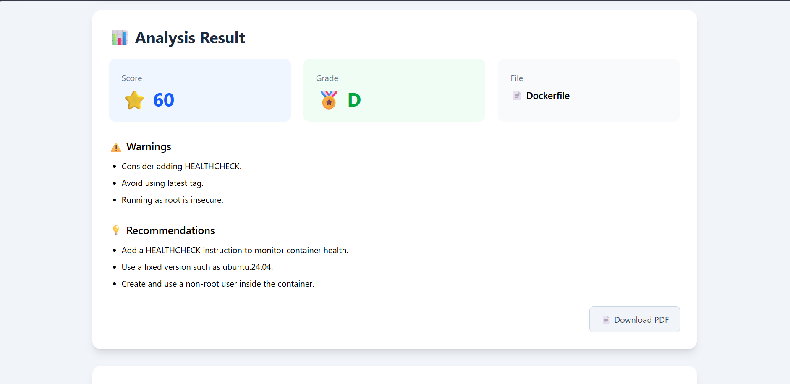
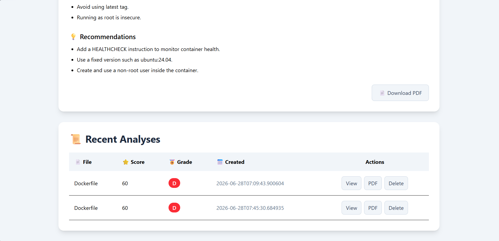
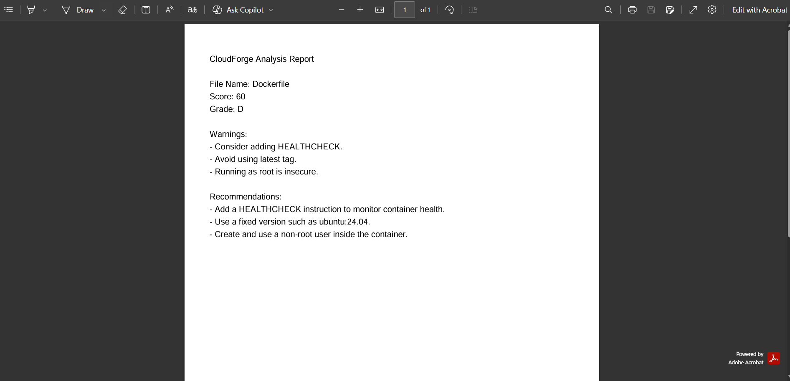

<div align="center">



# ☁️ CloudForge v2

### Dockerfile Security Analyzer & Cloud Deployment Platform

A cloud-native full-stack application that analyzes Dockerfiles for security vulnerabilities, generates professional PDF reports, and demonstrates modern cloud deployment using Docker, PostgreSQL, Nginx, and AWS EC2.

<br>

[](http://13.201.72.41)


</div>

---

# 📑 Table of Contents

- [Project Overview](#-project-overview)
- [Objectives](#-objectives)
- [Features](#-features)
- [System Architecture](#️-system-architecture)
- [Technology Stack](#️-technology-stack)
- [Application Screenshots](#-application-screenshots)
- [Project Structure](#-project-structure)
- [Installation](#️-installation)
- [Docker Deployment](#-docker-deployment)
- [AWS EC2 Deployment](#️-aws-ec2-deployment)
- [Application URLs](#-application-urls)
- [REST API Endpoints](#-rest-api-endpoints)
- [Security Features](#-security-features)
- [Future Roadmap](#-future-roadmap)
- [Contributing](#-contributing)
- [Author](#-author)

---

# 📖 Project Overview

CloudForge is a cloud-native Dockerfile Security Analyzer built using **Java 21**, **Spring Boot**, **React**, **PostgreSQL**, **Docker**, and **AWS EC2**.

The application automatically analyzes Dockerfiles to detect security issues and Docker best-practice violations before deployment. It generates a security score, assigns a grade, highlights warnings, provides optimization recommendations, and exports professional PDF reports.

CloudForge demonstrates modern backend development, secure authentication with JWT, REST API design, Docker containerization, cloud deployment, and DevOps practices. The entire application is containerized using Docker Compose and deployed on an AWS EC2 instance with Nginx acting as the reverse proxy.

---

# 🎯 Objectives

- Improve Dockerfile security by detecting common misconfigurations.
- Promote Docker best practices before application deployment.
- Generate professional PDF security reports.
- Demonstrate modern full-stack cloud application development.
- Showcase Docker, AWS, Java Spring Boot, and DevOps skills through a production-ready project.

---

# ✨ Features

-  Secure JWT Authentication
-  User Registration & Login
-  Dockerfile Upload
-  Dockerfile Security Analysis
-  Security Score & Grade Generation
-  Security Warnings & Recommendations
-  Professional PDF Report Generation
-  Analysis History Management
-  Delete Previous Analyses
-  PostgreSQL Database Integration
-  Dockerized Multi-Container Deployment
-  Nginx Reverse Proxy
-  AWS EC2 Cloud Deployment
-  Environment Variable Configuration using `.env`

---

# 🏗️ System Architecture

<p align="center">

</p>

CloudForge follows a modern **three-tier cloud-native architecture** where each component is containerized and managed using Docker Compose.

### Architecture Flow

```text
                        Internet
                            │
                            ▼
                    AWS EC2 (Ubuntu)
                            │
                    Docker Compose Stack
                            │
        ┌───────────────────┼───────────────────┐
        │                   │                   │
        ▼                   ▼                   ▼
 React + Vite          Spring Boot API      PostgreSQL
   (Nginx)               (Java 21)          Database
        │                   │
        └───────────────┬───┘
                        ▼
             Dockerfile Analysis Engine
                        │
                        ▼
        Security Score • Grade • PDF Report
```

### Architecture Components

| Component | Description |
|-----------|-------------|
| React + Vite | Modern frontend user interface |
| Nginx | Serves the React application and proxies API requests |
| Spring Boot | Backend REST API and business logic |
| Spring Security + JWT | User authentication and authorization |
| PostgreSQL | Stores users and analysis history |
| Docker Compose | Orchestrates all application containers |
| AWS EC2 | Hosts the complete application stack |

---

# 🛠️ Technology Stack

## Backend

| Technology | Version | Purpose |
|------------|---------|---------|
| Java | 21 | Programming Language |
| Spring Boot | 3.x | REST API Development |
| Spring Security | 6.x | Authentication & Authorization |
| JWT | Latest | Stateless Authentication |
| Spring Data JPA | Latest | ORM |
| Hibernate | Latest | Database Persistence |
| Maven | 3.x | Dependency Management |
| OpenPDF | Latest | PDF Report Generation |

---

## Frontend

| Technology | Purpose |
|------------|---------|
| React | User Interface |
| Vite | Frontend Build Tool |
| React Router | Routing |
| Axios | REST API Communication |
| Tailwind CSS | Responsive Styling |

---

## Database

| Technology | Purpose |
|------------|---------|
| PostgreSQL 16 | Relational Database |

---

## DevOps & Cloud

| Technology | Purpose |
|------------|---------|
| Docker | Application Containerization |
| Docker Compose | Multi-container Orchestration |
| Nginx | Reverse Proxy |
| AWS EC2 | Cloud Infrastructure |
| Git | Version Control |
| GitHub | Source Code Hosting |

---

# 📸 Application Screenshots

The following screenshots demonstrate the major features of CloudForge.

## 🔐 User Login

<p align="center">

</p>

Users authenticate securely using JWT-based authentication.

---

## 👤 User Registration

<p align="center">

</p>

New users can register before accessing the application.

---

## 📂 Dashboard & Dockerfile Upload

<p align="center">

</p>

Upload a Dockerfile and start the security analysis.

---

## 📊 Dockerfile Analysis Result

<p align="center">

</p>

CloudForge evaluates the uploaded Dockerfile and generates:

- Security Score
- Overall Grade
- Security Warnings
- Best Practice Recommendations
- PDF Report

---

## 🕘 Analysis History

<p align="center">

</p>

Previously generated reports can be viewed or deleted.

---

## 📄 PDF Report

<p align="center">

</p>

Generate and download a professional PDF security report.
---
---

# 📂 Project Structure

```text
cloudforge-v2
│
├── 📁 assets/                  # Banner and project assets
├── 📁 architecture/            # Architecture diagram
├── 📁 cloudforge/              # Spring Boot Backend
│   ├── src/
│   ├── Dockerfile
│   └── pom.xml
│
├── 📁 frontend/                # React Frontend
│   ├── src/
│   ├── public/
│   ├── Dockerfile
│   └── nginx.conf
│
├── 📁 screenshots/             # README screenshots
├── 📁 uploads/                 # Uploaded Dockerfiles
├── docker-compose.yml
├── .env.example
└── README.md
```

---

# ⚙️ Installation

## 1️⃣ Clone the Repository

```bash
git clone https://github.com/Sachingupta209/cloudforge-v2.git

cd cloudforge-v2
```

---

## 2️⃣ Configure Environment Variables

Create a `.env` file in the project root.

Example:

```env
POSTGRES_DB=cloudforge
POSTGRES_USER=postgres
POSTGRES_PASSWORD=your_password

JWT_SECRET=your_super_secret_key
JWT_EXPIRATION=86400000
```

---

## 3️⃣ Start the Application

```bash
docker compose up --build -d
```

---

## 4️⃣ Verify Running Containers

```bash
docker compose ps
```

Expected containers:

- PostgreSQL
- Spring Boot Backend
- React + Nginx Frontend

---

# 🐳 Docker Deployment

Build the containers:

```bash
docker compose build
```

Run the application:

```bash
docker compose up -d
```

Stop all services:

```bash
docker compose down
```

View logs:

```bash
docker compose logs -f
```

Restart services:

```bash
docker compose restart
```

---

# ☁️ AWS EC2 Deployment

CloudForge is deployed on an Ubuntu AWS EC2 instance using Docker Compose.

Deployment steps:

1. Launch an Ubuntu EC2 instance.
2. Install Docker and Docker Compose.
3. Clone the repository.
4. Configure the `.env` file.
5. Start the application.

```bash
git clone https://github.com/Sachingupta209/cloudforge-v2.git

cd cloudforge-v2

docker compose up --build -d
```

---

# 🌍 Live Demo

| Environment | URL |
|------------|-----|
| Live Application | http://13.201.72.41 |

---

# 💻 Local URLs

| Service | URL |
|----------|------------------------------|
| Frontend | http://localhost |
| Backend API | http://localhost:8081/api |
| PostgreSQL | localhost:5432 |

---

# 📚 REST API Endpoints

## Authentication

| Method | Endpoint | Description |
|---------|----------|-------------|
| POST | `/api/auth/register` | Register a new user |
| POST | `/api/auth/login` | Authenticate user |

---

## Dockerfile Analysis

| Method | Endpoint | Description |
|---------|----------|-------------|
| POST | `/api/files/upload` | Upload and analyze a Dockerfile |

---

## PDF Reports

| Method | Endpoint | Description |
|---------|----------|-------------|
| POST | `/api/report/pdf` | Generate and download a PDF report |

---

## Analysis History

| Method | Endpoint | Description |
|---------|----------|-------------|
| GET | `/api/history` | Retrieve all analyses |
| DELETE | `/api/history/{id}` | Delete an analysis |

---

# 🔒 Security Features

- JWT-based Authentication
- BCrypt Password Encryption
- Spring Security Authorization
- Protected REST APIs
- Docker Container Isolation
- Environment Variable Configuration
- PostgreSQL Persistent Storage
- Nginx Reverse Proxy

---

# 🚀 Future Roadmap

### ✅ Completed

- JWT Authentication
- Dockerfile Security Analysis
- PDF Report Generation
- PostgreSQL Integration
- Docker Compose Deployment
- AWS EC2 Deployment

### 📌 Planned Features

- GitHub Actions CI/CD
- Kubernetes Deployment
- SonarQube Integration
- AI-powered Dockerfile Recommendations
- AWS S3 Report Storage
- Email Notifications
- Admin Dashboard
- Multi-file Dockerfile Analysis
- User Profile Management

---

# 🤝 Contributing

Contributions are welcome!

If you have ideas to improve CloudForge:

1. Fork the repository.
2. Create a feature branch.
3. Commit your changes.
4. Push the branch.
5. Open a Pull Request.

---

# 👨‍💻 Author

## Sachin Gupta

**Java Backend Developer | Cloud & DevOps Enthusiast**

### Technologies

- Java
- Spring Boot
- React
- PostgreSQL
- Docker
- AWS EC2
- Nginx

**GitHub**

https://github.com/Sachingupta209

---

# ⭐ Support

If you found this project useful, please consider giving it a ⭐ on GitHub.

Your support helps improve the project and motivates future development.

---

<div align="center">

## 🚀 Built with Java • Spring Boot • React • Docker • PostgreSQL • AWS

### ⭐ CloudForge v2 ⭐

**Dockerfile Security Analyzer & Cloud Deployment Platform**

Made with  by **Sachin Gupta**

